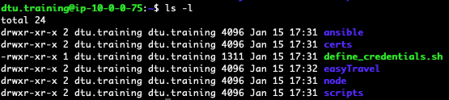

## Environment Login

### Ubuntu server

1. Confirm SSH login to your Ubuntu Server
**Note:** Login details will be provided by the instructor

1. After logging in you should have the following files/folders on your home directory:
    

### Dynatrace Tenant

1. Confirm login to your Dynatrace Tenant

    **Note:** Login details will be provided by the instructor

### ServiceNow instance

1. Confirm login to your ServiceNow Personal Instance/Certified Instance.
