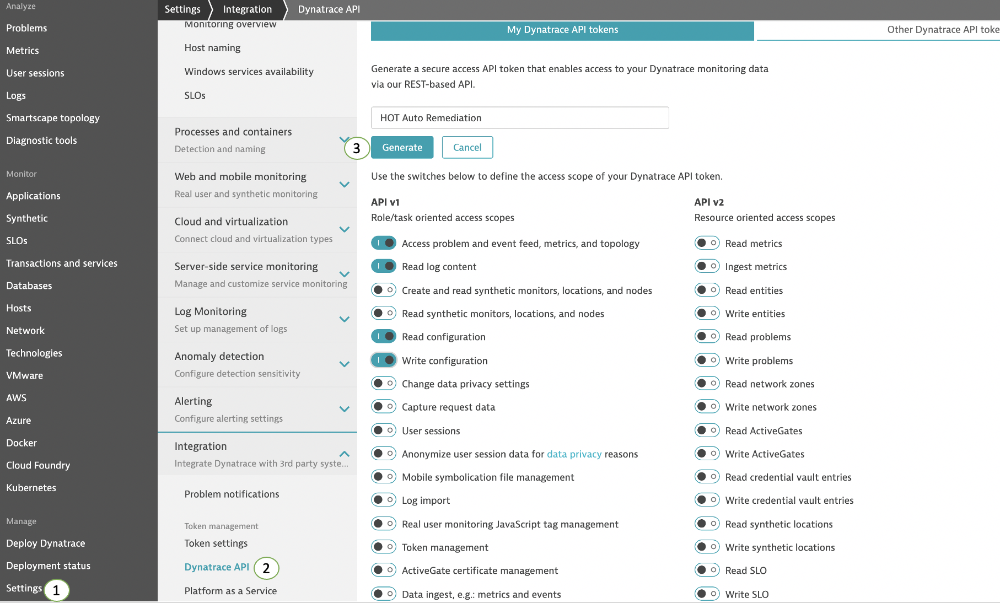
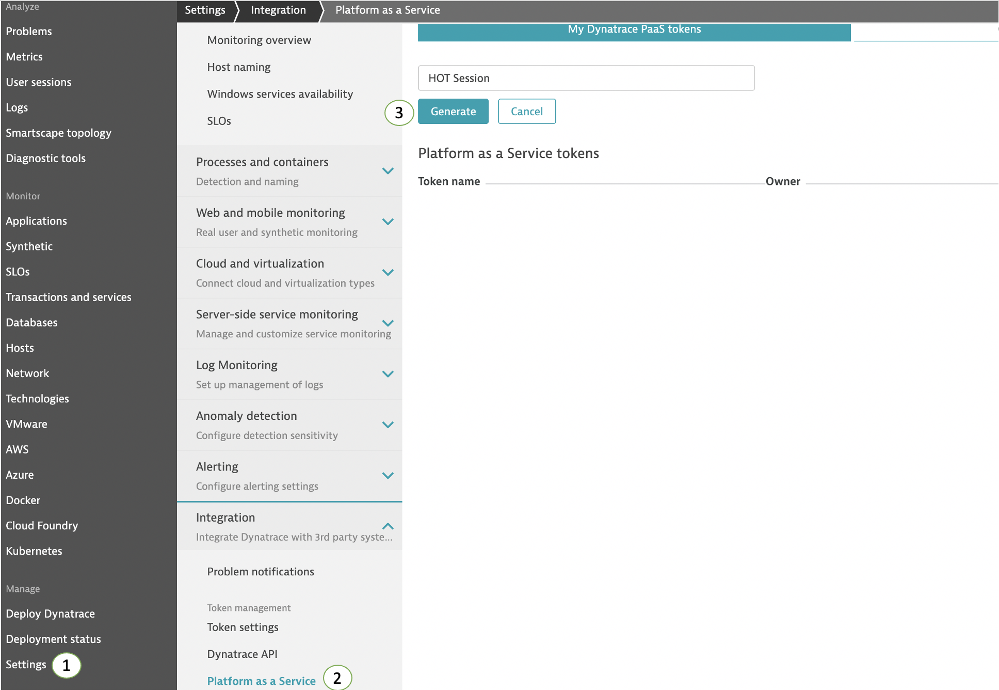

## Dynatrace Credentials

In this step we will create the dynatrace tokens needed to download and install the `OneAgent` as well as authenticate with the `Dynatrace` REST API.

### Create Dynatrace API token

1. On your dynatrace environment, navigate to `Settings -> Integration -> Dynatrace API` and create a new API token with any name and assign it the following scope (API v1):
    * Access problem and event feed, metrics, and topology
    * Read log content
    * Read Configuration
    * Write configuration

1. Click the `Generate` button.

    

1. Store the API token on a secure place.

### Create Dynatrace PAAS token

1. Navigate to Settings -> Integration -> Platform as a service and create a new PAAS token with any name.

1. Click the `Generate` button.

    

1. Store the PAAS token on a secure place.