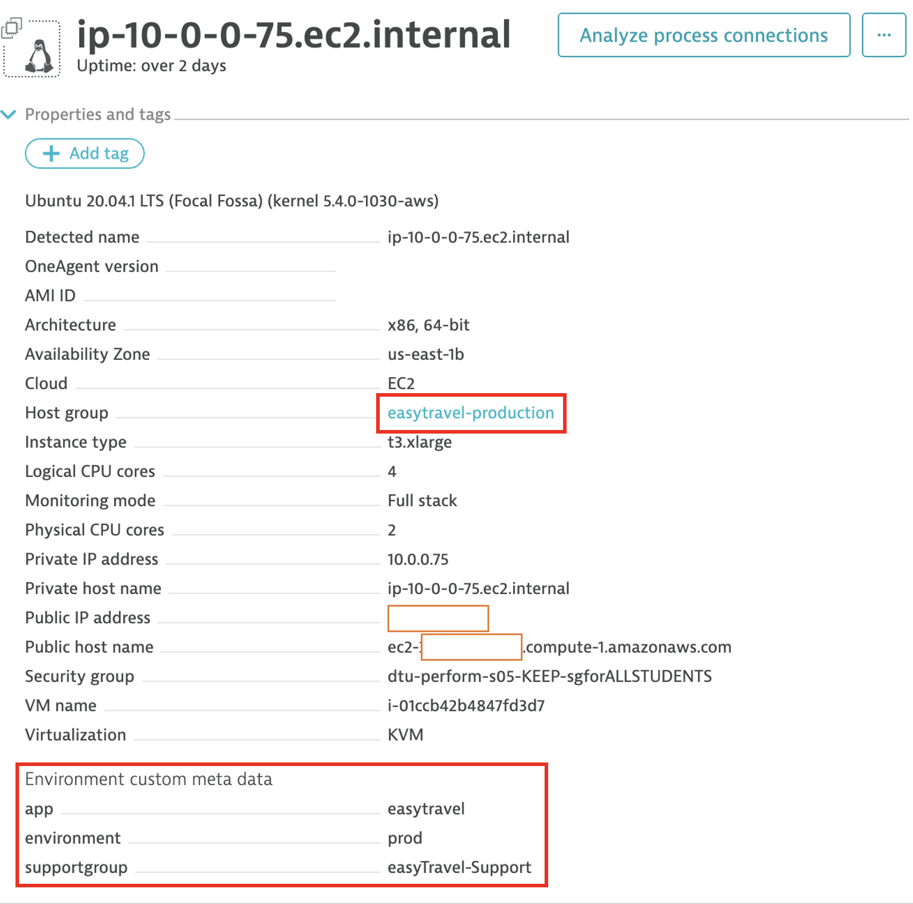

## OneAgent Deployment

1. Install the OneAgent ansible galaxy role:

    ```bash
    ansible-galaxy install dynatrace.oneagent
    ```

1. Add your dynatrace environment URL and PAAS token to the yaml file on the `ansible` directory:

    ```bash
    cd ~/ansible/
    ```

    ```bash
    vi oneagent.yml
    ```

    ```yaml
    ---
    - hosts: localhost
    become: true
    roles:
        - role: dynatrace.oneagent
    vars:
        dynatrace_environment_url: your-environment-id.live.dynatrace.com
        dynatrace_paas_token: your-paas-token
        dynatrace_oneagent_host_metadata: environment=prod app=easytravel supportgroup=easyTravel-Support
        dynatrace_oneagent_install_args:
            --set-app-log-content-access: true
            --set-infra-only: false
            --set-host-group: easytravel-production
    ```

1. Install OneAgent

    ```bash
    ansible-playbook oneagent.yml
    ```

1. You can verify the OneAgent intallation by running the following command:

    ```bash
    systemctl status oneagent
    ```

1. On dynatrace navigate to `Hosts`, search for your host and ensure that the metadata set during the deployment of the OneAgent is visible:

    
