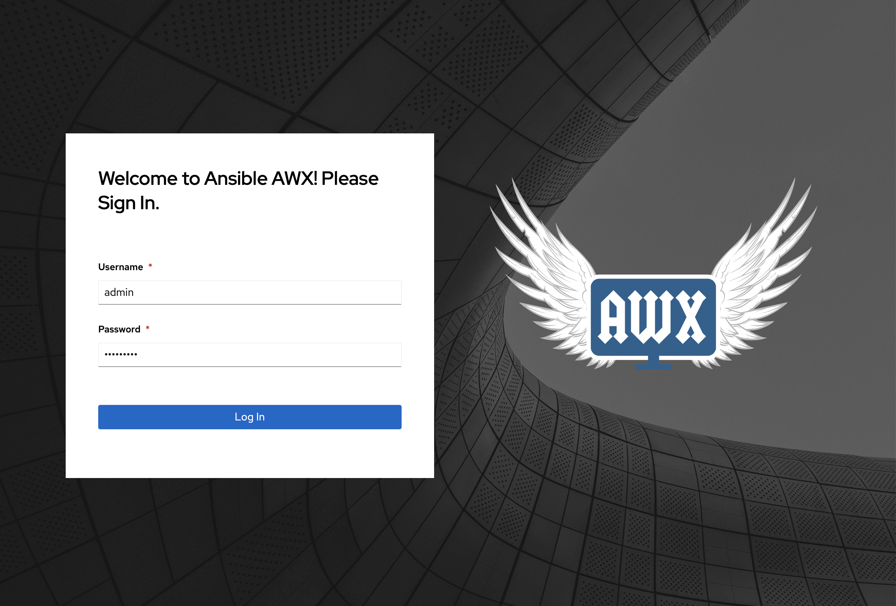
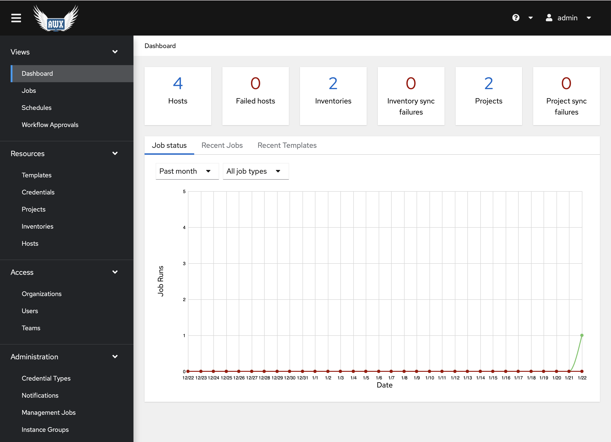

## Deploy ansible AWX

1. Deploy `Ansible AWX` using the command below:

    ```bash
    ~/scripts/install_awx.sh
    ```

    **Note:** The AWX URL and login details will be part of the script execution output.

1. Save the AWX URL, credentials and the `Dynatrace Automated Remediation for Memory Leak` template ID as they will be necessary on the upcoming labs.

1. Login to ansible AWX:

    

1. After logging in, view all the configurations created during the deployment including templates, credentials, credential types, projects and inventories.

    

1. Review the playbooks used by ansible AWX through the labs: [playbooks](https://github.com/dynatrace-ace/perform2021-vhot-auto-remediation/tree/main/playbooks)
    * enable_backend.yml: registers your host to the HAProxy server for load balancing easyTravel.
    * remediation.yml: playbook triggered during remediation of the easyTravel app.
    * trigger_memory_leak.yml: triggers the `MediumMemoryLeak` plugin via the easyTravel REST API.

1. (Optional) Navigate to `Settings -> Miscellaneous System` and click on the `Edit` button on the bottom left to increase the `Idle Time Force Log Out` seconds to 50000.