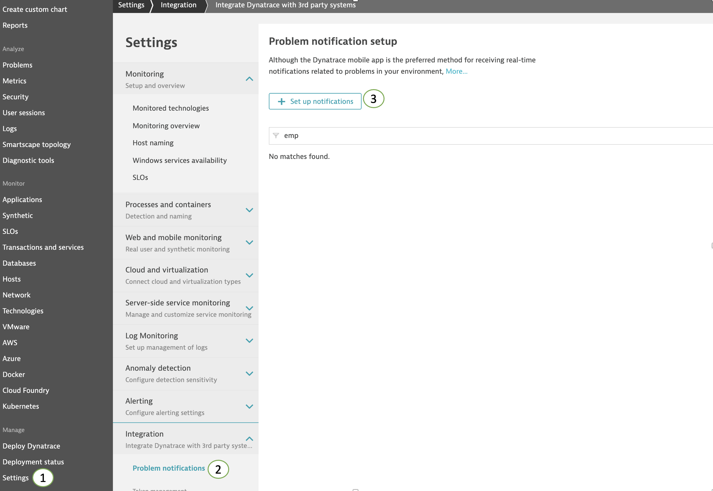
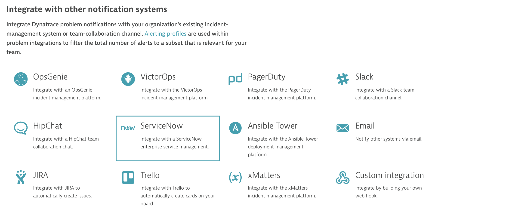
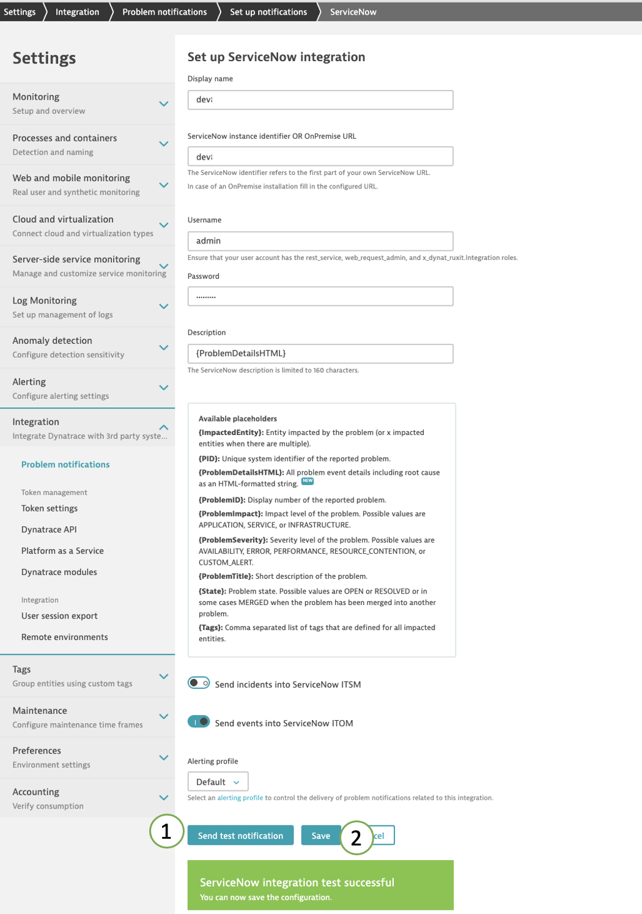
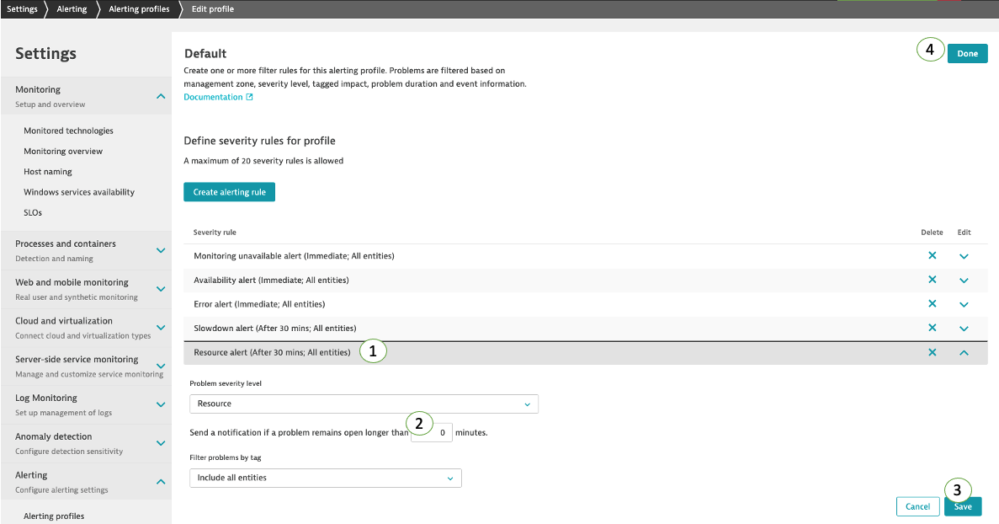
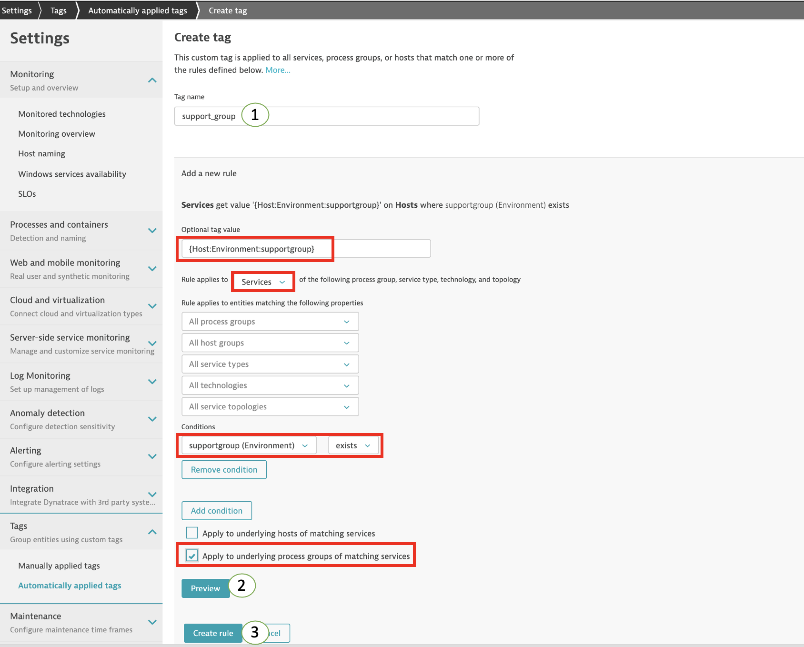
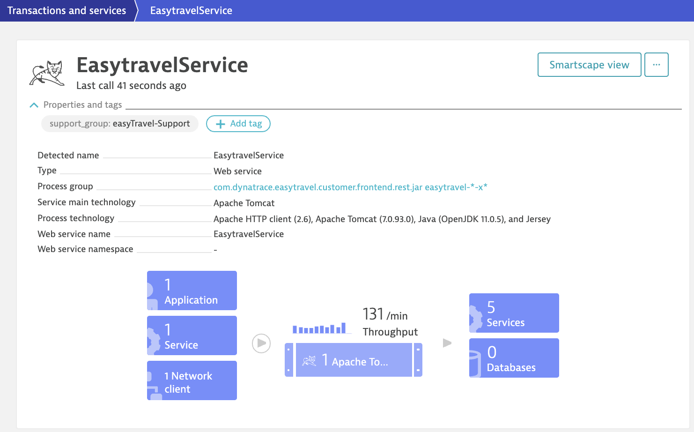
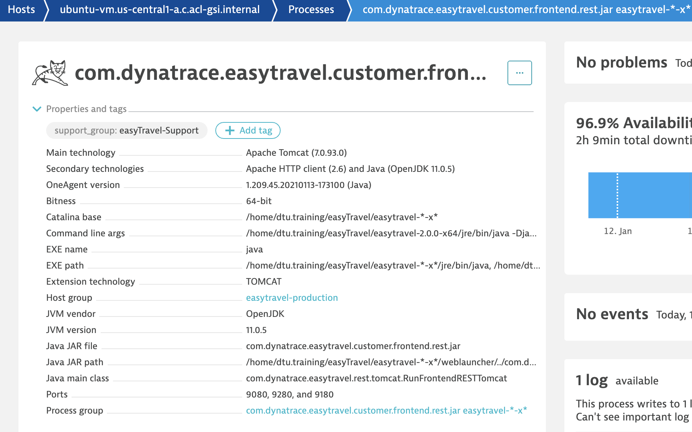

## Configure Problem Notification

### Create Problem Notification for ServiceNow events

1. Open your Dynatrace environment.
1. Navigate to `Settings` -> `Integration` -> `Problem notifications` and click on the `Set up notifications` button:

    

1. Select ServiceNow:
    

1. Complete the ServiceNow fields with the following values:

    - **Display name:** Your ServiceNow instance identifier; e.g. dev12345
    - **ServiceNow instance identifier OR OnPremise URL:** Your ServiceNow instance identifier; e.g. dev12345
    - **Password:** your ServiceNow user password
    **Note:** The ServiceNow user needs to have the evt_mgmt_integration or admin role(s) assigned to it.
    - **Description:** {ProblemDetailsHTML}
    - **Send incidents into ServiceNow ITSM:** disabled
    - **Send incidents into ServiceNow ITOM:** enabled
    - **Alerting profile:** Default

1. Click on `Send test notification`, if successful a green box should appear.
1. Click on `Save`

    

### Update Default Alerting Profile

We want the automated remediation to trigger as soon as the problem is detected, in order for that to happen the `Default` Alerting Profile needs to be updated so that the problem event is sent to ServiceNow upon problem detection without delays.

1. In Dynatrace Navigate to `Settings` -> `Alerting` -> `Alerting profiles` and click on the `Default` alerting profile name to open it.

1. Click on the `Resource alert` severity rule and set the value of `Send a notification if a problem remains open longer than` to **0** `minutes`:

1. Click `Save`.

1. On the top right of the Alerting Profile screen click on the blue `Done` button.

    

### Create Automatic Tagging Rule for easyTravel processes and services

1. In Dynatrace Navigate to `Settings` -> `Tags` -> `Automatically applied tags` and click on the `Create tag` button:

    

1. Create a new Automatic Tagging Rule with the following fields set:

    - **Tag name (Case Sensitive):** support_group

1. Click on `Add a new rule`:
    - **Optional Tag Value:** {Host:Environment:supportgroup}
    - **Rule applies to:** Services
    - **Conditions:** `supportgroup [Environment] exists`
    - **Apply to underlying process groups of matching services:** enabled

1. Click `Preview`
1. Click `Create rule`

    

1. Click on `Save changes` on the bottom left corner of the page.

1. Test the rule by going to `Transactions and services` and viewing the `EasytravelService` and its process:

    

    