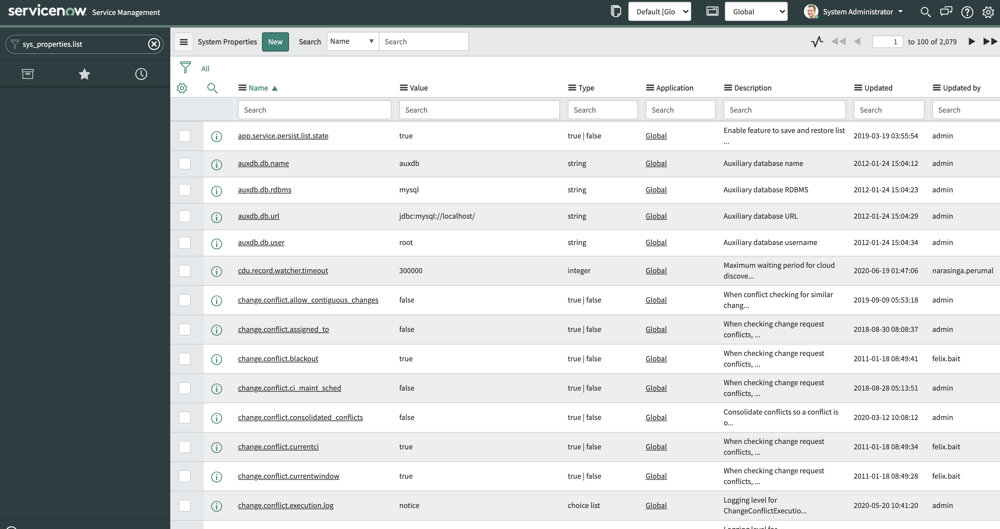
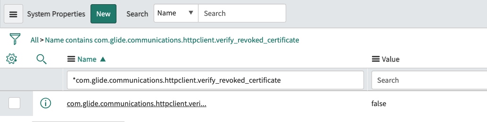
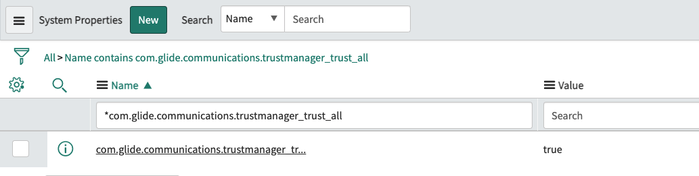
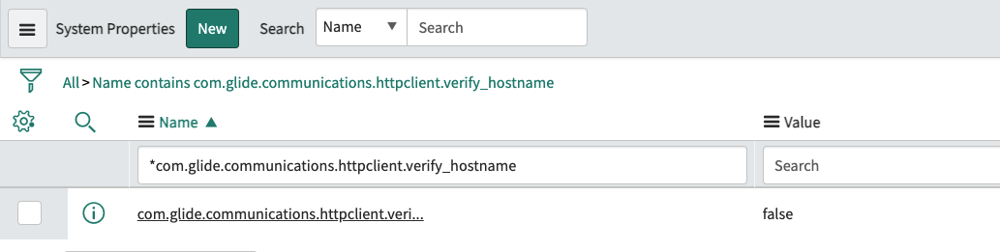

## Create Connection Aliases

### Create Basic Auth Credential

1. Navigate to `Integration Hub -> Connections & Credentials -> Credential` and click on `New`:

    

1. Select `Basic Auth Credentials`

1. Set the following values for the credential fields:

    - **Name:** AWX Basic Auth
    - **User name:** admin
    - **Password:** dynatrace

    

1. Click `Submit`.

### Create Ansible AWX Connection

1. Navigate to `Integration Hub -> Connections & Credentials -> Connection & Credential Aliases` and click on the `Ansible AWX` Connection Alias:

    

1. Under the `Connections` related list, click on `New`:

    

1. Set the `Connection` fields to these values:
    - **Name:** Ansible AWX Connection
    - **Credential:** AWX Basic Auth
    - **Connection alias:** Ansible_AWX
    - **Connection URL:** your ansible AWX url - `https://XX.XX.XX.XX/`

    

1. Click `Submit`.

### Disable SSL verification in ServiceNow Instance

Since we'll be using self-signed certificates, we'll need to add/update system properties in ServiceNow to ignore any untrusted certificates and hosts.

1. On the ServiceNow filter navigator type in `sys_properties.list` and press `Enter/return` on your keyboard:

    

1. Create the following properties with their respective values:

    - **com.glide.communications.httpclient.verify_revoked_certificate:** false

    

1. Update the following properties with their respective values:

    - **com.glide.communications.trustmanager_trust_all:** true

    

    - **com.glide.communications.httpclient.verify_hostname:** false
    
