## Create Remediation Flow

In this step we'll create the suflow that will run the different remediation steps including creating a ServiceNow incident and updating the existing alert based on the remediation status. We'll use one of the existing subflows provided with the system base to simplify the process.

### Copy existing Subflow

1. In ServiceNow, navigate to `Process Automation` -> `Flow Designer`, after clicking on Flow designer a new tab will open on your browser.
i
1. Click on the `Subflows` tab and then search for `Create ncident` under the Name column, click on the `Create Incident` line to open the subflow:

    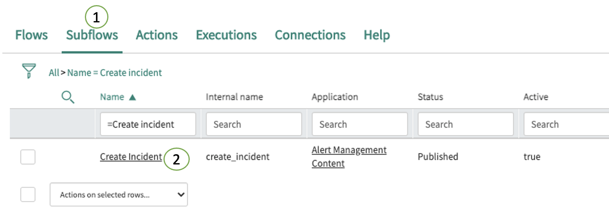

1. After opening up the `Subflow`, click on the 3 vertical dots on the top right corner and then click on `Copy subflow`:

    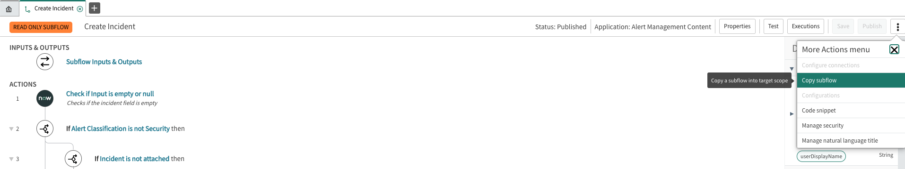

1. On the `Copy Subflow` configuration box, set the following:

    - **Name:** Dynatrace Automated Remediation for Memory Leak
    - **Application:** Global

    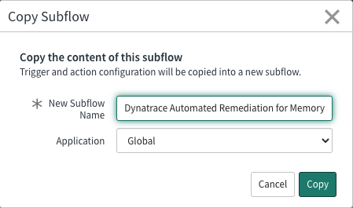

1. Press `Copy`

1. You should now see the copy of the new `Dynatrace Automated Remediation for Memory Leak` subflow.

### Add steps to Subflow

Add the required steps to execute the remediation and trigger the ansible AWX template.

1. Click on `Create Task` (Step #9) to expand the action.

1. Click on the `+ Add Field Value` button and select `Assignment Group`

1. Click on the script `f(x)` toggle button to expand the script box.

1. Paste the following script:

    ``` javascript
    var dtData = JSON.parse(fd_data.subflow_inputs.ah_alertgr.additional_info);
    var dtTags = JSON.stringify(dtData.tags);
    var sgArray = dtTags.split(",");
    var sgArray_length = sgArray.length;
    for (var i = 0; i < sgArray.length; i++) {
        var arrTag = sgArray[i];
        if (arrTag.includes('support_group')) {
            var sgName = dtTags.match(/.*support_group:\s*([a-zA-Z-]+)/i);
        }
    }
    if (sgName.length > 0) {
        var sysGroup = new GlideRecord('sys_user_group');
        sysGroup.get('name', sgName[1]);
        return sysGroup.sys_id;
    } else {
        return "";
    }
    ```

    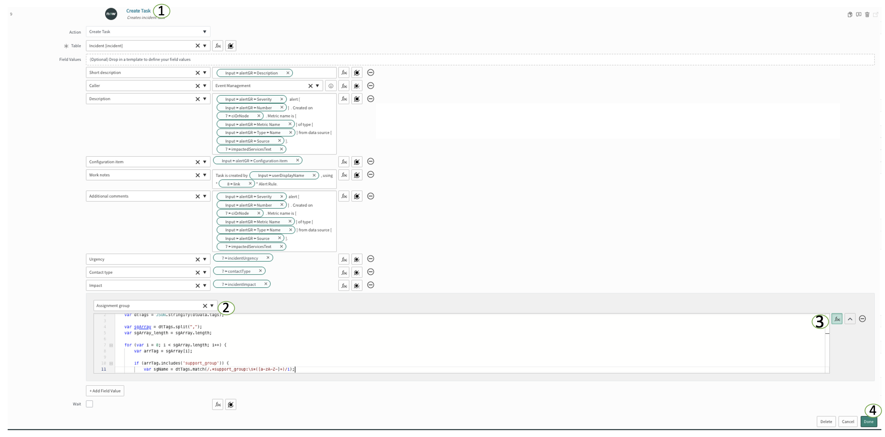

1. Click done


1. Look for step **#11** `Update Alert Record` and click on the **+** icon that appears when you hover your mouse under the step:

    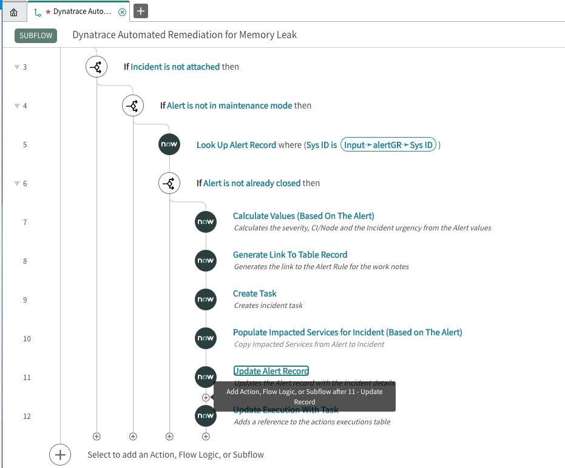

1. Select `Subflow` -> `Global` -> `Trigger ansible AWX Template`

    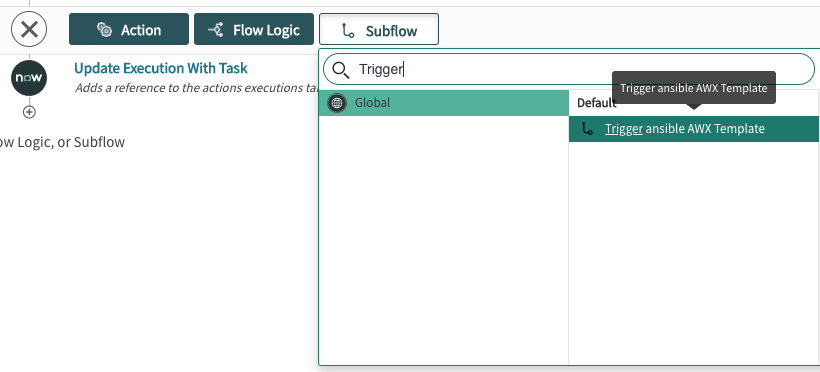

1. Complete the fields with the following values:
    - **Template ID:** Enter the ID of the ansible AWX `Dynatrace Automated Remediation for Memory Leak` template.
    - **Alert:** Click on the Data pill picker for the alert, select `Subflow inputs` -> `alertGR`.

    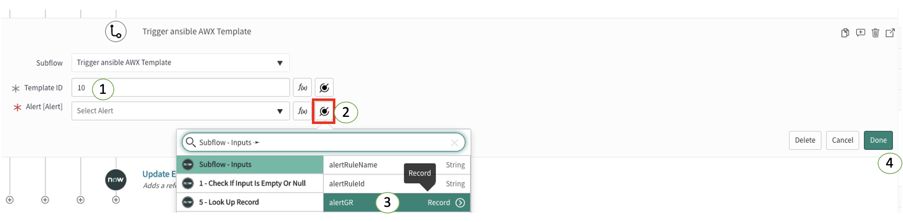

1. Click Done.

1. Create a new step under the `12 - Trigger ansible AWX Template` subflow step.

1. Select `Flow logic` -> `If` and complete the fields as shown below:

    - **Condition:** subflow finishes successfully
    - **Condition 1 (case sensitive):** Click on the `data pill picker` button and select `12 - Trigger ansible AWX Template -> Status is successful`

    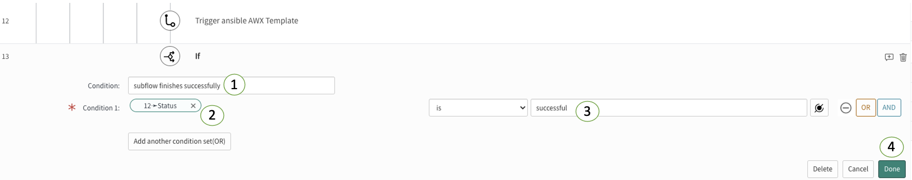

1. Click `Done`

1. Add an `Update Record` action under the `13 - If` step with the following values:
    - **action:** Update Record
    - **Record:** Click on the `data pill picker` and select - `Subflow-Inputs -> alertGR`
    - **Fields:** Click on the `+ Add Field Value` buttons, select `Work notes` and set the field value to `Remediation completed successfully`

    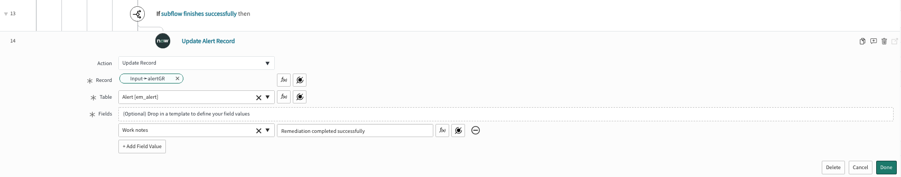

1. Click `Done`

1. Create a new step under the `13 - If subflow finishes successfully then` conditional step:

    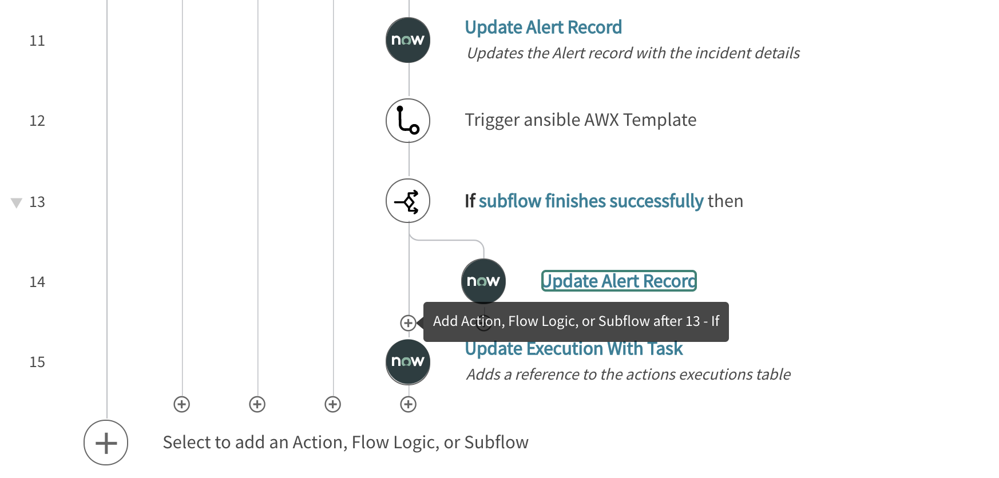

1. Select `Flow Logic` -> `Else`
    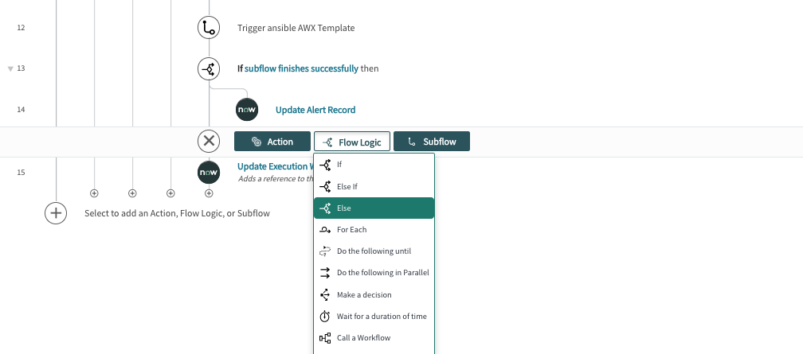

1. Add an `Update Record` action under the `15 - Else` step with the following values:
    - **action:** Update Record
    - **Record:** Click on the `data pill picker` and select - `Subflow-Inputs -> alertGR`
    - **Fields:** Click on the `+ Add Field Value` buttons, select `Work notes` and set the field value to `Remediation failed`

    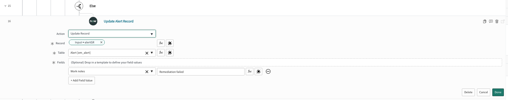

1. Click `Done`

1. The subflow should now look like this:

    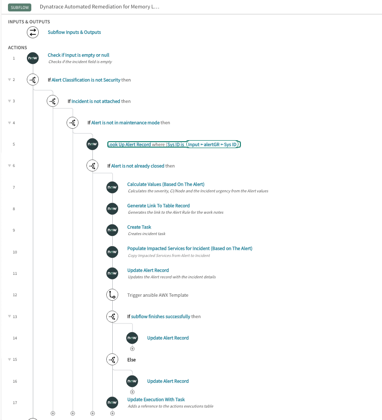

1. On the top right corner of the **Flow Designer** page click `Save` and then click `Publish`.
