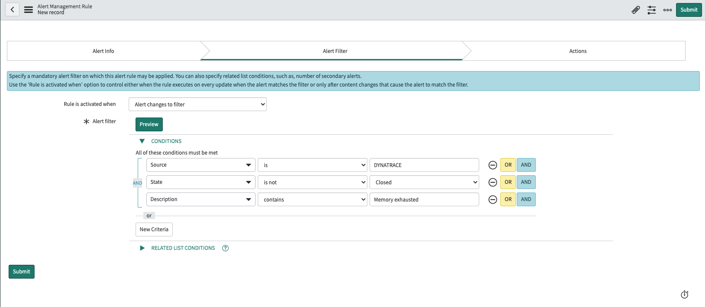
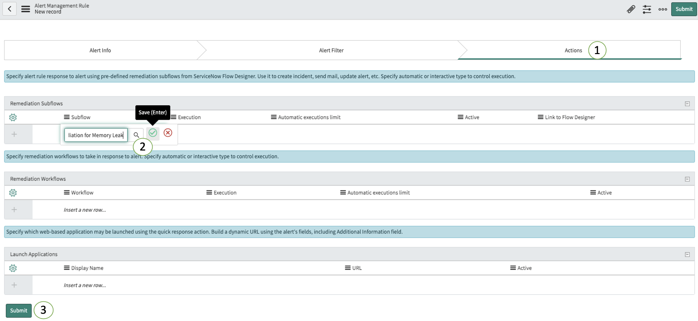

## Create Alert Management rule

1. In ServiceNow, go to `Event Management` -> `Rules` -> `Alert Management Rules`.

1. Create a new rule by pressing the `New` button.

1. Set the name of the Alert Management Rule to `Memory Leak Automated Remediation`.

1. Click on the Alert Filter tab.

1. Set the following filters (Case Sensitive):

    - `Source` is `DYNATRACE` 
    - **AND** `State` is not `Closed`
    - **AND** `Description` contains `Memory exhausted`

    

1. Click on the Actions tab of the alert management rule.

1. Double click the row under the `Subflow` column on the `Remediation Subflows` table.

1. Search for the `Dynatrace Automated Remediation for Memory Leak` subflow.

1. Click the green checkmark to save.

    

1. Finally, click the `Submit` button.
